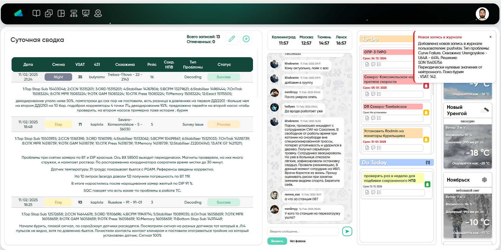
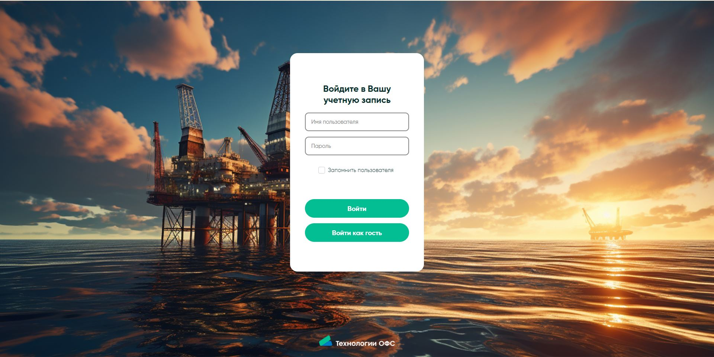
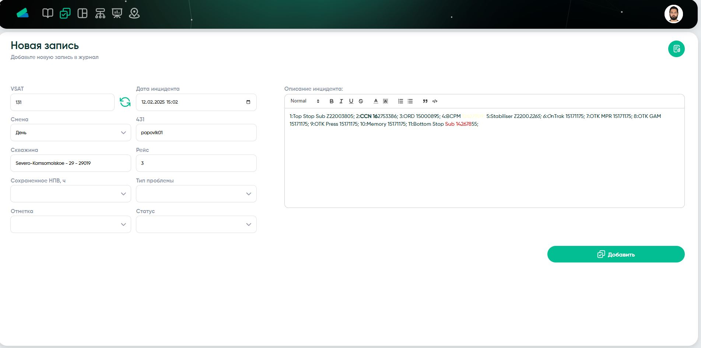
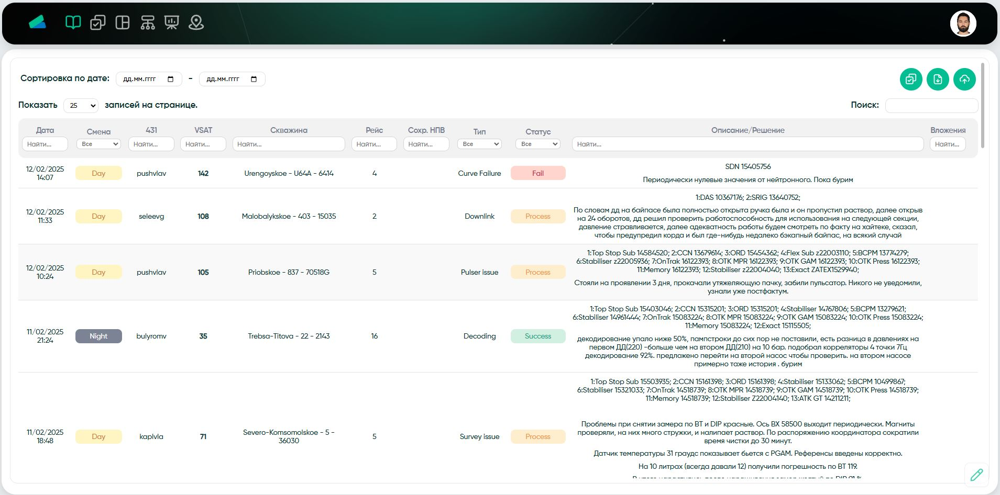
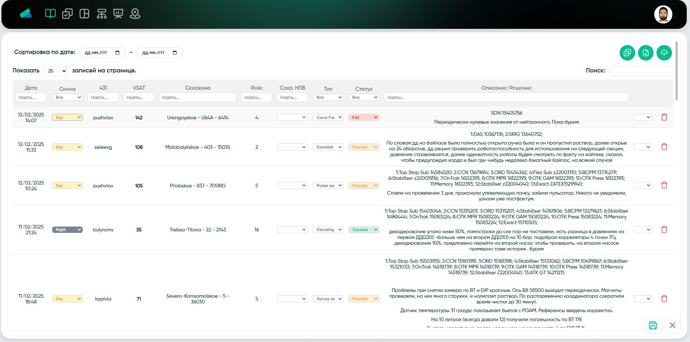
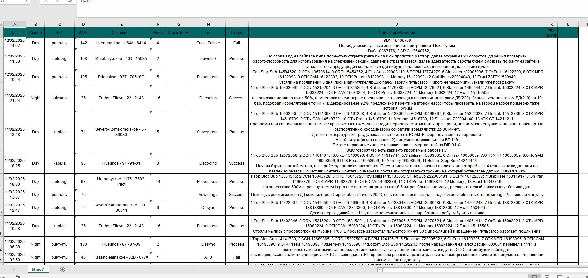
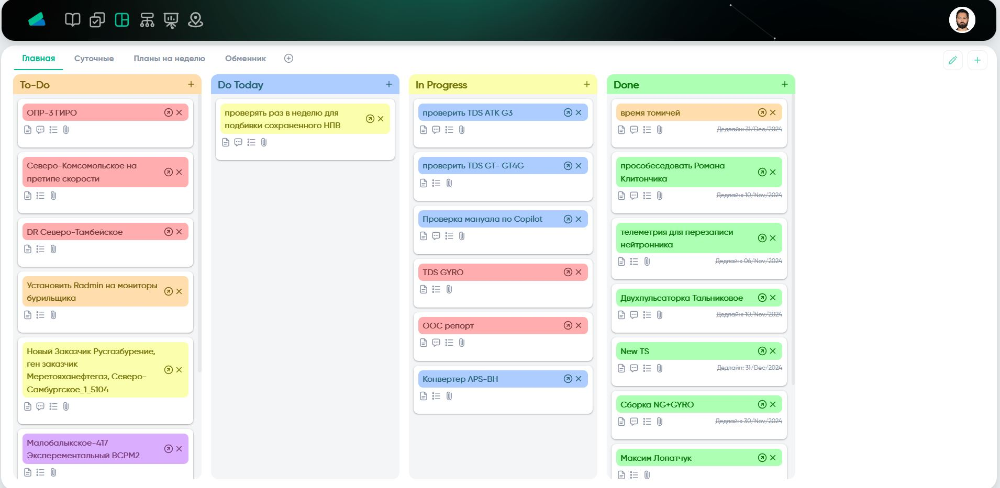
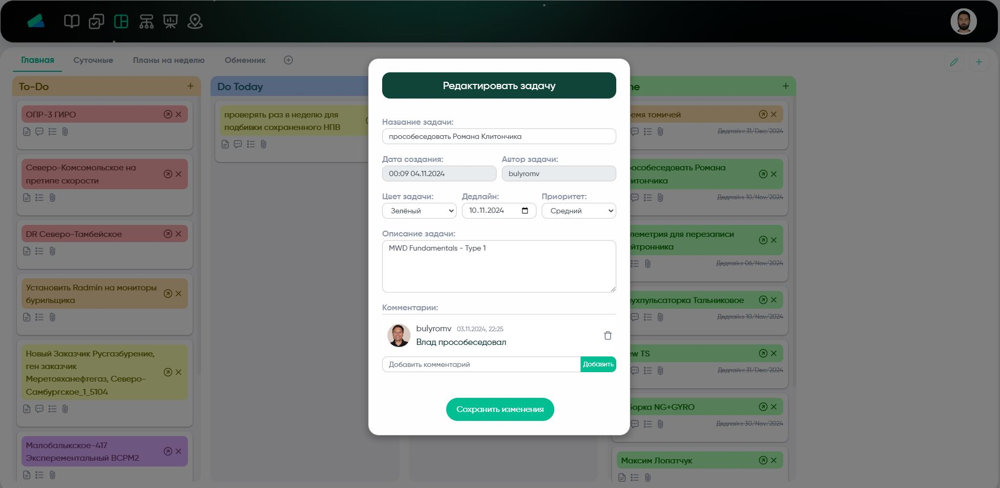
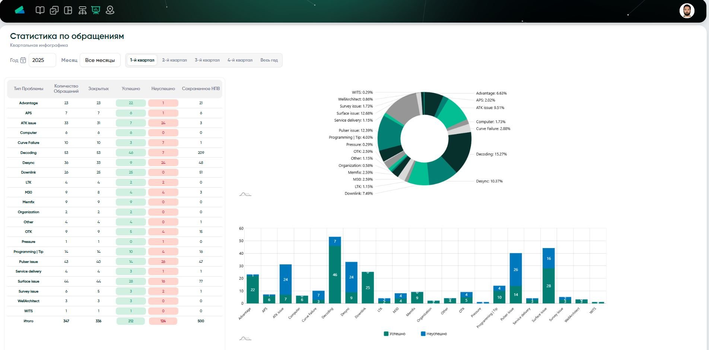
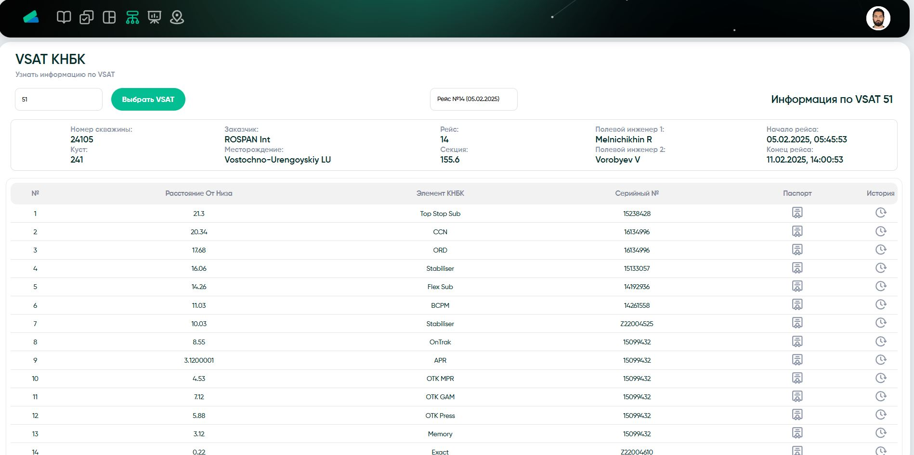

Веб-приложение для добавления записей группы Технической-Поддержки.
ASP.Net MVC+WebAPI

********
Возможность добавлять данные в базу данных, автоматически заполнять данные по актуальной работе в записи. 
Все данные доступны в журнале инцидентов, с возможностью редактирования ранее добавленных данных. Есть функционал выгрузки в виде Excel файла а также возможность загружать новые данные по Excel-формы.
Данные визуализируются в виде временной статистики. 

********
Канбан-доска для добавления задач, комментариев, файлов к ним. Функционал создания новых досок и колонок, перемещения задач и перекидывания их в другие доски. 

********
Просмотр информации с выбранной виртуальной машины - подключение к SQL-базе данных. Поиск паспортов и просмотр информации по внешнему адресу через API

********
Главная страница - с быстрым добавлением новых записей в базу, телеграм чатом, списком и просмотром задач из Канбан-доски и погодным виджетом через внешний API.

